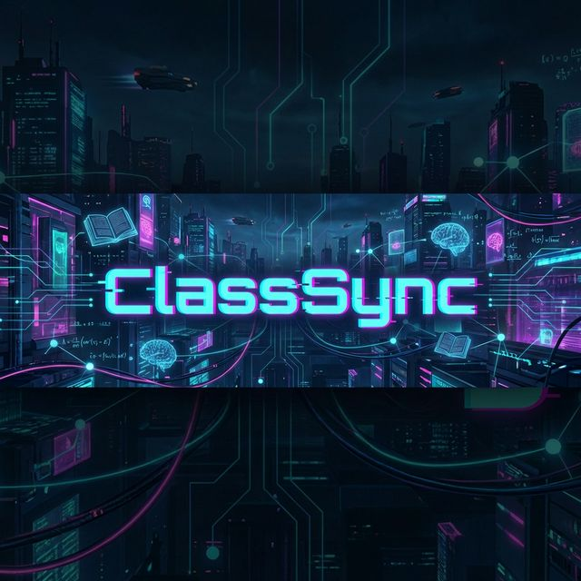

<div align="center">
  

  # ⚡ ClassSync ⚡
  
  **The Cyberpunk-Themed Student Management System of Tomorrow**

  [](https://reactjs.org/)
  [](https://vitejs.dev/)
  [](https://tailwindcss.com/)
  [](https://nodejs.org/)
  [](https://expressjs.com/)
  [](https://www.mongodb.com/)

  <br />

  <!-- [View Demo](#) • [Report Bug](#) • [Request Feature](#) -->
</div>

---

## 🚀 About The Project

**ClassSync** redefines the educational management experience with a sleek, high-contrast **Cyberpunk interface**. Gone are the days of boring, white-and-grey dashboards. Welcome to a platform that feels as advanced as the subjects you're studying.

Designed for efficiency, speed, and visual impact, ClassSync seamlessly connects Students and Administrators.

### Key Features

| 🎓 For Students | 🛡️ For Admins |
| :--- | :--- |
| **📊 Smart Dashboard**: View attendance & upcoming deadlines at a glance. | **👥 Student Management**: Add/Remove students & manage data effortlessly. |
| **📅 Live Timetable**: Interactive schedule with real-time updates. | **📢 Global Notices**: Broadcast important announcements instantly. |
| **📝 Digital Assignments**: Submit & track assignments in one place. | **📈 Analytics**: Visualized class performance & attendance stats. |
| **📥 Resource Hub**: Download notes & study materials securely. | **🗓️ Calendar Control**: Configure term dates & holidays. |
| **🎨 Profile Customization**: Manage your digital identity. | **✅ Quick Attendance**: Bulk actions for rapid roll calls. |

---

## 🛠️ Installation & Setup

Get ClassSync running locally in minutes.

### Prerequisites

- Node.js (v16+)
- MongoDB (Local or Atlas)

### 1. Clone the Repository

```bash
git clone https://github.com/yourusername/classsync.git
cd classsync
```

### 2. Backend Setup

```bash
cd server
npm install
# Set up your .env file before running dev
npm run dev
```

### 3. Frontend Setup

```bash
cd client
npm install
npm run dev
```

---

## 🔐 Environment Variables

Create a `.env` file in both `client` and `server` directories.

**Client (`client/.env`)**
```env
VITE_API_BASE_URL=http://localhost:5001/api
```

**Server (`server/.env`)**
```env
PORT=5001
MONGO_URI=mongodb+srv://<username>:<password>@cluster.mongodb.net/classsync
JWT_SECRET=your_super_secret_key_change_this
ADMIN_SECRET=admin_registration_key
```

---

## 🤝 Contributing

Contributions make the open-source community such an amazing place to learn, inspire, and create. Any contributions you make are **greatly appreciated**.

1. Fork the Project
2. Create your Feature Branch (`git checkout -b feature/AmazingFeature`)
3. Commit your Changes (`git commit -m 'Add some AmazingFeature'`)
4. Push to the Branch (`git push origin feature/AmazingFeature`)
5. Open a Pull Request

---

## 📜 License

Distributed under the MIT License. See `LICENSE` for more information.

---

<div align="center">
  <sub>Built with ❤️ by the Sai Dheeraj.</sub>
</div>
